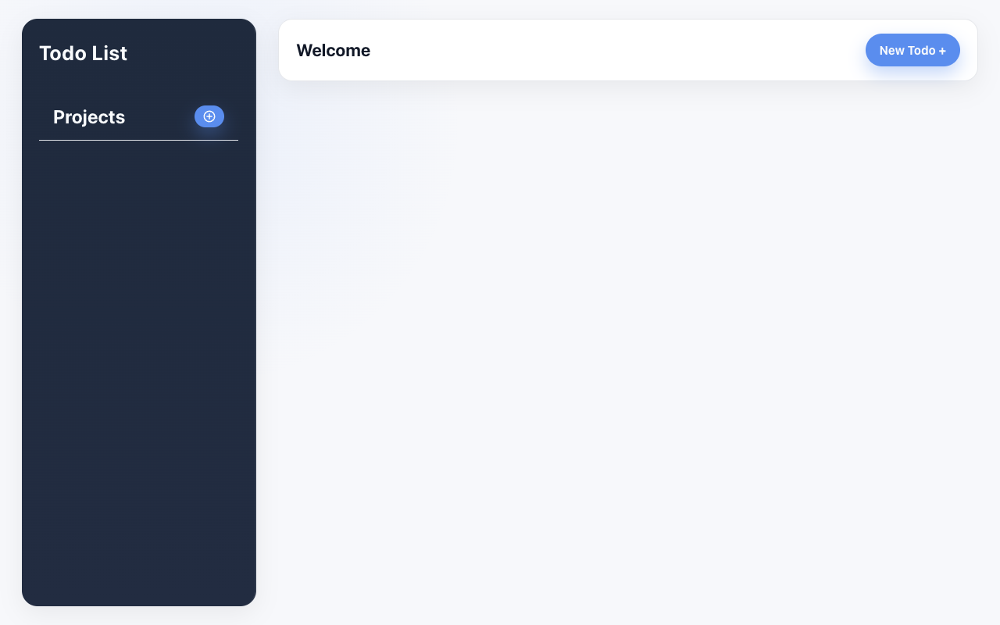

# To-Do List

An object-oriented JavaScript task manager with project groups, dated todos, priority
levels, and `localStorage` persistence — bundled with Webpack. Built to practice OOP
principles in JavaScript.

🔗 **Live demo:** [todo-list-nine-sooty-39.vercel.app](https://todo-list-nine-sooty-39.vercel.app/)



## Features

- Object-oriented project and todo models for structured task data.
- Multiple project groups with active-project switching.
- Create/update forms for editing task titles, dates, priorities, and notes.
- `date-fns` sorting helpers for due dates.
- `localStorage` persistence so projects and todos survive a refresh.

## Tech stack

JavaScript (OOP) · HTML · CSS · `date-fns` · **Webpack**

## Getting started

```bash
npm install
npm start        # webpack dev server (opens the browser)
npm run build    # production bundle
```

## Project structure

Logic is split into focused modules: `project`, `todo`, `all-projects`, `storage`,
`form`, `renderer`, and `update-form` — separating data models from rendering and
persistence.

## What I practiced

Modeling a domain with **classes/objects**, separating storage and rendering concerns,
and persisting state across sessions with `localStorage`.

## License

Odin Project coursework — original implementation by Aziz Umarov.
